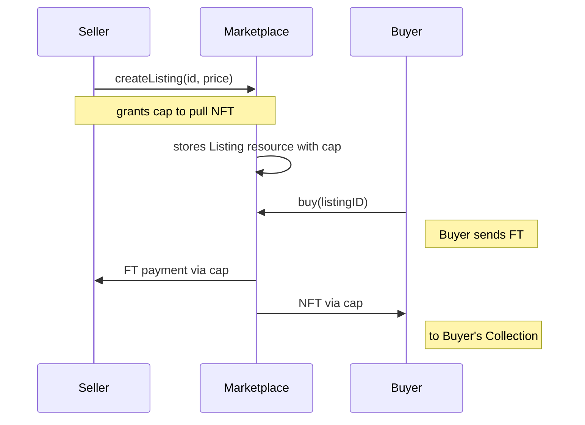

# Marketplace On Flow

```mermaid
sequenceDiagram
    participant Seller
    participant Marketplace
    participant Buyer

    Seller->>Marketplace: createListing(id, price)
    Note over Seller,Marketplace: grants cap to pull NFT
    Marketplace->>Marketplace: stores Listing resource with cap

    Buyer->>Marketplace: buy(listingID)
    Note right of Buyer: Buyer sends FT

    Marketplace->>Seller: FT payment via cap
    Marketplace->>Buyer: NFT via cap
    Note right of Buyer: to Buyer's Collection
```
# Tech-Stack
- Cadence
- Flow
- Flow-cli

# Licenses
MIT
